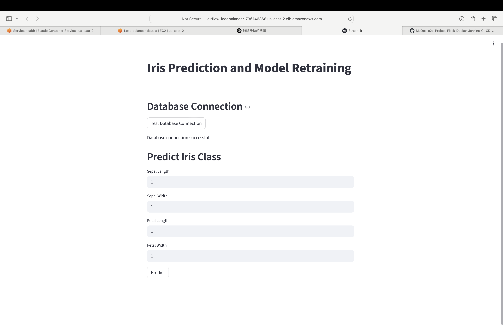

# Project Structure Diagram

The core of this test project is the use of **Apache Airflow**, an open-source workflow orchestration platform, to automate the entire machine learning pipeline — from data collection and cleaning, to training and prediction — on a scheduled basis. The project is fully deployed through **Docker → ECR → ECS**, with **S3** used for storing trained models and **RDS** for storing both Airflow metadata and prediction results. Additionally, **Streamlit** is integrated as a lightweight frontend tool for testing RDS connectivity and validating model predictions through a user-friendly interface.


```
Machine Learning Engineering Project in Pitsco: Airflow-Flask-Docker-AWS-ECS-S3 and RDS
├── (4)app.py                # Main application file for Streamlit front End
├── (1)Dockerfile            # Dockerfile for containerizing the project
├── (3)entrypoint.sh         # Entrypoint script for initializing Airflow and Streamlit
├── README.md             # Project documentation
├── (2)requirements.txt      # Python dependencies for the project in the Dockerfile
├── (Test Purpose)test_mysql_connection.ipynb  # Jupyter Notebook for testing MySQL database connection
├── (1)train.py              # Test script for training the machine learning model
├── (5)dags/                 # Folder containing Airflow DAGs
│   └── ml_pipeline_dag.py  # Airflow DAG for the machine learning pipeline
```

This structure outlines the project organization and the purpose of each file and folder.

---

## Data Flow and Execution Overview

### (0) Deployment Phase - (0,1,2,3,4)

- The **Dockerfile** exposes two ports:
  - `8501` for the Streamlit frontend (used for database testing and model prediction).
  - `8080` for the Airflow Web UI (used for DAG monitoring and administration).
- It installs all Python dependencies via `requirements.txt`.
- A sample model is trained using `train.py` during the Docker build phase, ensuring Streamlit can load a model on first launch.
- The container entrypoint (`entrypoint.sh`) is triggered to start both Airflow and Streamlit.

### (1) Airflow DAG Execution (`ml_pipeline_dag.py`) - (5)

The DAG is scheduled to run **every 2 minutes** for testing. It automates the following tasks:

- **Task 1: Connect to Database**
  - Establishes a connection to an RDS MySQL instance using environment variables.
  - Simulates access to real-world PA (proposal analytics) data.

- **Task 2: Clean Data**
  - Preprocesses the Iris dataset.
  - Does not rely on external data sources, ensuring isolated operation.

- **Task 3: Train Model**
  - Trains a logistic regression model.
  - Uploads the serialized `.pkl` model to an S3 bucket for persistent storage and reuse.

- **Task 4: Predict**
  - Loads the model and performs predictions.
  - Writes results into the same RDS database into a new table called `predictions`.

This design enables **Power BI** to automatically refresh and visualize prediction results by connecting directly to the RDS MySQL database, eliminating the need for additional gateways or configurations.

---


# Project Overview for IT Department

## Project Structure

### Files
- **`app.py`**
  - Main application file for Streamlit Front End and database connections test.
  - Provides a user-friendly interface for administrators to test database connections and run predictions.


- **`Dockerfile`**  
  Defines the containerization workflow for the project. It includes the following steps:

  - **Base Image**:  
    Uses a lightweight `python:3.9-slim-bullseye` image to ensure compatibility with Apache Airflow.

  - **Environment Configuration**:  
    Sets environment variables to:
    - Prevent `.pyc` files from being written
    - Enable unbuffered Python output for better logging
    - Disable pip cache and frontend interaction

  - **System Dependencies**:  
    Installs essential Linux packages:
    - `build-essential`
    - `default-libmysqlclient-dev`
    - `libssl-dev`, `libffi-dev`, and `pkg-config`  
    These are required for database connectivity and secure communication.

  - **Python Dependencies**:  
    Installs required Python packages listed in `requirements.txt` using pip.

  - **Working Directory Setup**:  
    Sets `/app` as the working directory and creates `/opt/airflow/data` to temporarily store model files and prediction outputs inside the container.

  - **Model Initialization**:  
    Executes `train.py` during the build process to generate an initial machine learning model. This is used by Streamlit for demo and testing purposes.

  - **Entrypoint Script**:  
    Copies `entrypoint.sh` and grants execution permission. This script initializes Airflow (scheduler + webserver) and starts Streamlit.

  - **Port Exposure**:  
    Exposes the following ports:
    - `8501` for the **Streamlit Front End**
    - `8080` for the **Airflow Web UI**

- **`entrypoint.sh`**  
  Startup script that initializes key services when the container launches. It ensures that both **Apache Airflow** and the **Streamlit UI** are started correctly in the background.

  - ✅ Starts the **Airflow webserver**, binding it to `0.0.0.0:8080` so it is accessible externally:
    ```bash
    airflow webserver --port 8080 --host 0.0.0.0 &
    ```

  - ✅ Starts the **Streamlit frontend**, also binding to `0.0.0.0:8501` for external access:
    ```bash
    streamlit run app.py --server.port=8501 --server.address=0.0.0.0
    ```

- **`requirements.txt`**
  - Lists all Python dependencies required for the project.

- **`test_mysql_connection.ipynb（Not Important,Test Purpose)`**
  - Jupyter Notebook for testing MySQL database connectivity.
  - Includes steps to load environment variables, connect to the database, and execute queries.

- **`train.py(Not Important, Test Purpose)`**
  - Script for training a machine learning model.
  - Saves the trained model to a specified path for later use.

- **`.dockerignore`**
  - Ensures sensitive files like `.env` are excluded from the Docker image.

### Subdirectories

#### `dags/`
- Contains Airflow DAGs for orchestrating machine learning pipelines.
- **`ml_pipeline_dag.py`**
  - Defines an Airflow DAG for managing the machine learning pipeline tasks.

---

## Tools Used

### **Airflow**
- Used for orchestrating machine learning pipelines.
- DAGs are defined to automate tasks like data cleaning, model training, and predictions.

### **Docker**
- Containerizes the application for consistent deployment.
- The `Dockerfile` ensures all dependencies are installed and the application is ready to run.

### **AWS Services**

#### **ECR (Elastic Container Registry)**
- Stores Docker images for deployment.
- Images are pushed to ECR and pulled by ECS for running tasks.

#### **ECS (Elastic Container Service)**
- Runs containerized tasks and services.
- Used to deploy the application and manage its lifecycle.

#### **S3 (Simple Storage Service)**
- Stores trained machine learning models.
- Models are uploaded to S3 after training and downloaded for predictions.

#### **RDS (Relational Database Service)**
- Two databases are used:
  - **Airflow Database**: Stores Airflow metadata.
  - **Prediction Database**: Stores prediction results.

#### **Secrets Manager**
- Securely stores sensitive information like database credentials.
- Ensures credentials are not hardcoded in the application.

#### **IAM (Identity and Access Management)**
- Manages permissions for AWS resources.
- Roles and policies are assigned to ECS tasks and users.

---

## Deployment Process

### **Step 1: Push Docker Image to ECR**
1. Build the Docker image:
   ```bash
   docker build -t airflow-dags-project .
   ```
2. Tag the image:
   ```bash
   docker tag airflow-dags-project:latest <account-id>.dkr.ecr.<region>.amazonaws.com/airflow-dags-project:latest
   ```
3. Push the image to ECR:
   ```bash
   docker push <account-id>.dkr.ecr.<region>.amazonaws.com/airflow-dags-project:latest
   ```

### **Step 2: Deploy to ECS**
1. Create an ECS cluster.
2. Define a task with the ECR image and required environment variables.
3. Attach an IAM role to the task for accessing S3, RDS, and Secrets Manager.
4. Create a service to run the task and ensure high availability.

### **Step 3: Configure S3**
1. Create an S3 bucket for storing models.
2. Attach a policy to the IAM role for accessing the bucket.

### **Step 4: Set Up RDS**
1. Create two RDS instances:
   - One for Airflow metadata.
   - One for storing prediction results.
2. Configure security groups to allow access from ECS tasks.

### **Step 5: Use Secrets Manager**
1. Store database credentials in Secrets Manager.
2. Attach a policy to the IAM role for accessing Secrets Manager.

---

## Request for IT Department

### **User and Role Assignment**
- Assign me a user account in the company’s AWS account.
- Grant the following permissions:
  - **ECR**: Push and pull Docker images.
  - **ECS**: Create and manage tasks and services.
  - **S3**: Read and write access to the model bucket.
  - **RDS**: Access to the Airflow and prediction databases.
  - **Secrets Manager**: Access to stored credentials.

---